<p align="center">
  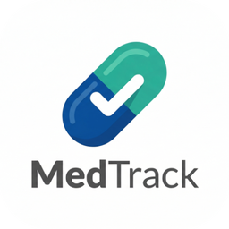
</p>

<h1 align="center">MedTrack</h1>

<p align="center">
  An Android app that helps patients stick to their medication schedule, log symptoms and
  spot trends — with openFDA drug lookups, AI coaching tips powered by Google Gemini,
  and a dashboard for clinicians.
</p>

<p align="center">
  
  
  
  
  
</p>

<p align="center">
  <a href="../../releases/latest"></a>
</p>

## See it in action

<table>
  <tr>
    <td align="center">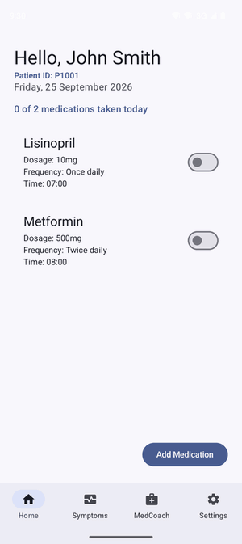<br><sub>Ticking off today's doses</sub></td>
    <td align="center">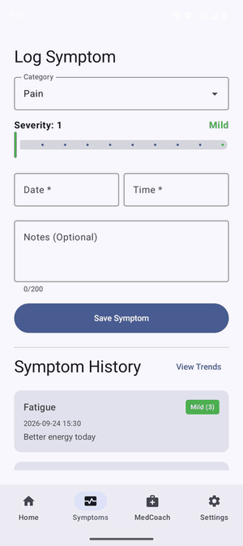<br><sub>Severity slider with animated colour</sub></td>
    <td align="center">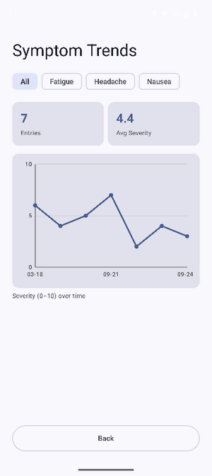<br><sub>Canvas trend chart, redrawn per filter</sub></td>
  </tr>
</table>

## Screenshots

<table>
  <tr>
    <td align="center">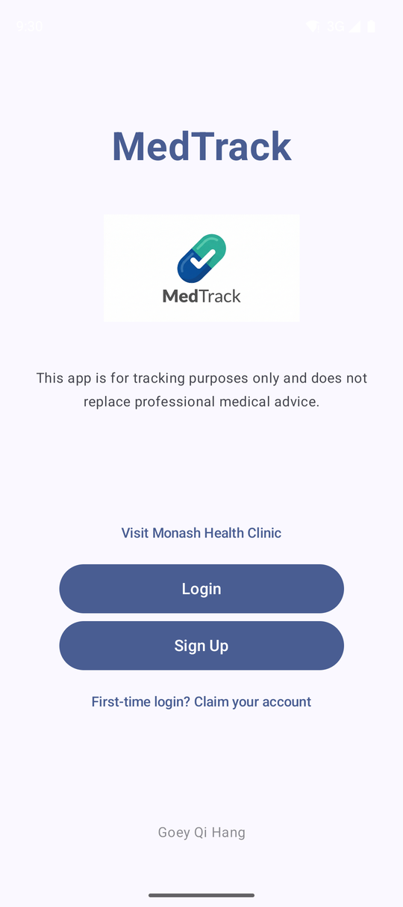<br><sub>Welcome</sub></td>
    <td align="center">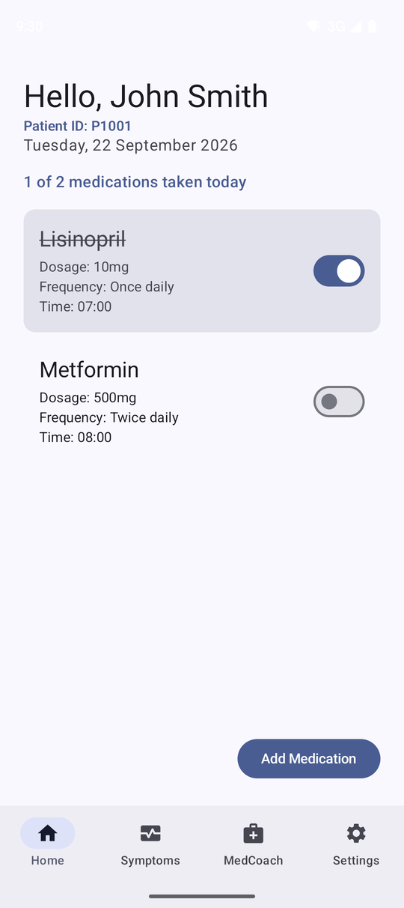<br><sub>Today's medications</sub></td>
    <td align="center">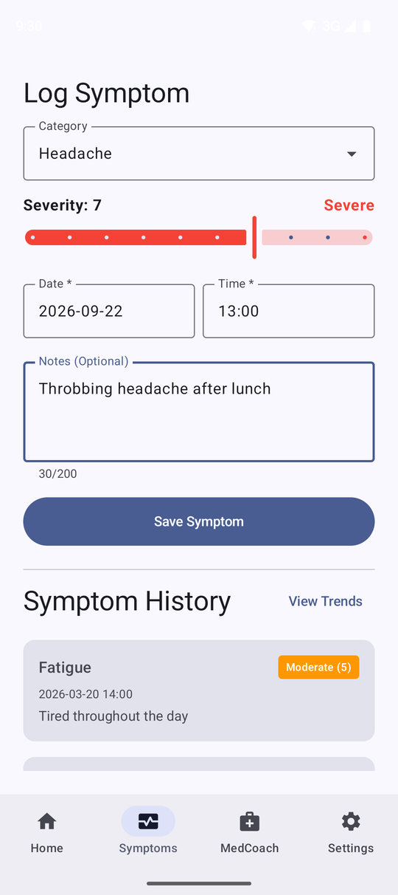<br><sub>Log a symptom</sub></td>
    <td align="center">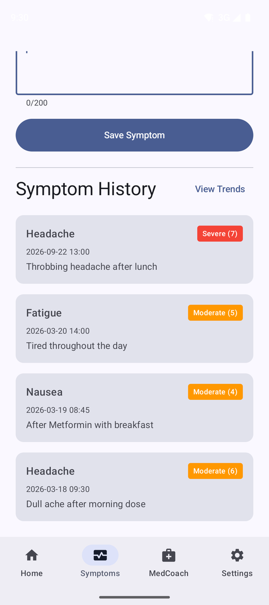<br><sub>Symptom history</sub></td>
  </tr>
  <tr>
    <td align="center">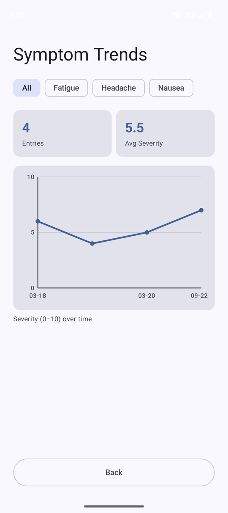<br><sub>Trend chart</sub></td>
    <td align="center">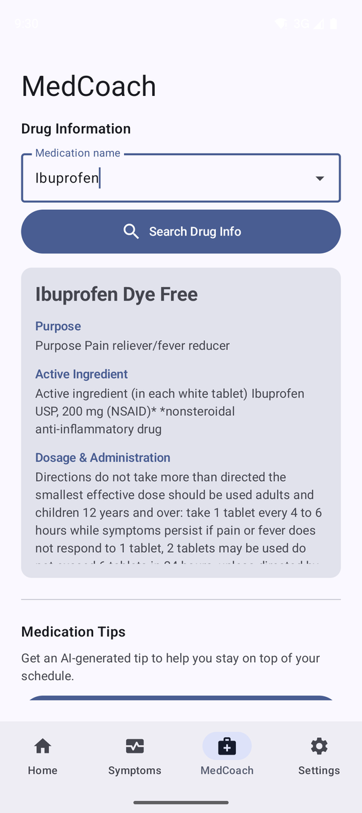<br><sub>MedCoach drug lookup</sub></td>
    <td align="center">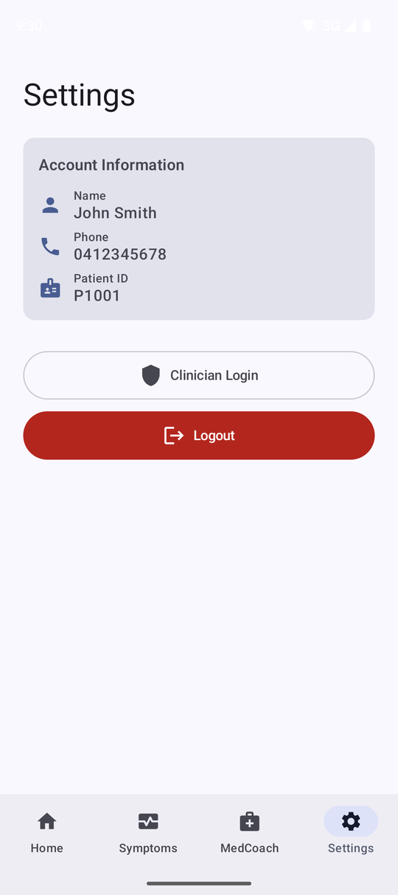<br><sub>Settings</sub></td>
    <td align="center">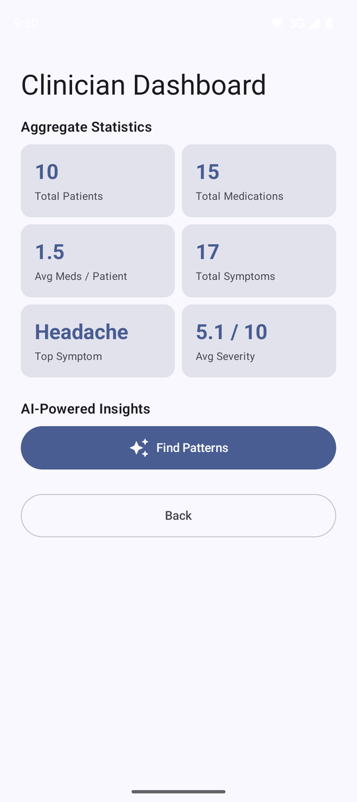<br><sub>Clinician dashboard</sub></td>
  </tr>
</table>

## Features

**For patients**

- **Accounts.** Sign up with a name, an Australian mobile number and a password, and
  receive an auto-generated Patient ID. Pre-registered patients use *Claim account*:
  they verify their Patient ID and phone number, then set a password. The session
  persists between launches.
- **Today's medications.** A daily checklist of the patient's medications with a
  "taken" switch for each one and a progress summary. Taken states are stored per
  medication *per day*, so the checklist starts fresh every morning.
- **Add medication.** A validated form covering name, dosage amount and unit,
  frequency, type, notes and a Material 3 time picker for the scheduled time.
- **Symptom log.** Category, a 1–10 severity slider whose colour animates between
  mild, moderate and severe, date and time pickers, notes, and a colour-coded history.
- **Symptom trends.** A severity-over-time line chart drawn directly on a Compose
  `Canvas` (no charting library), with category filter chips and summary cards.
- **MedCoach.**
  - Look up any drug in the [openFDA drug label API](https://open.fda.gov/apis/drug/label/)
    (purpose, active ingredient, dosage and warnings). The search field suggests the
    patient's own medications.
  - Generate a personalised adherence tip with Gemini. The prompt includes the
    patient's medication schedule and five most recent symptoms. Every tip is saved,
    so earlier ones can be reviewed later.

**For clinicians**

- An access-key-protected dashboard with aggregate statistics across all patients:
  patients, medications, average medications per patient, symptoms logged, the most
  common symptom and the average severity.
- **Find Patterns** sends only these aggregated, anonymised numbers to Gemini and
  shows three insights it identifies.

## Tech stack

| Area | Tools |
| --- | --- |
| Language | Kotlin 2.2, Coroutines and Flow |
| UI | Jetpack Compose (BOM 2026.03.01), Material 3, Navigation Compose, lifecycle-aware state collection |
| Architecture | MVVM with repositories, unidirectional data flow, manual dependency injection (`AppContainer`) |
| Local data | Room 2.8 (via KSP), SharedPreferences |
| Networking | Retrofit 2.11, OkHttp 4.12, Gson |
| External APIs | openFDA Drug Label API, Google Gemini API (`gemini-2.5-flash`) |
| Build | Gradle 9.3 with Kotlin DSL and a version catalog, Android Gradle Plugin 9.1, R8 |
| Testing | JUnit 4, kotlinx-coroutines-test |

## Architecture

MedTrack is a single-activity app. `MainActivity` hosts a Navigation Compose graph, and
the four main destinations share a bottom navigation bar. Each feature package follows
the same MVVM shape:

- `XxxScreen.kt` is a composable that renders the state and forwards user events to
  the ViewModel. It collects state with `collectAsStateWithLifecycle()`.
- `XxxUiState.kt` is an immutable data class that describes everything the screen shows.
- `XxxViewModel.kt` exposes a `StateFlow<XxxUiState>`. Its `Factory` takes the
  repositories it needs from the app-wide `AppContainer`.

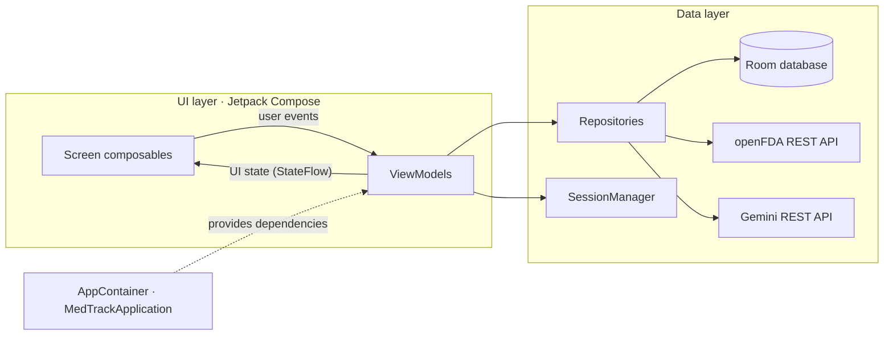

### Project structure

```text
app/src/main/java/com/qihang/medtrack/
├── MedTrackApplication.kt     # creates the AppContainer
├── AppContainer.kt            # app-wide dependencies (manual DI)
├── MainActivity.kt            # single activity + navigation graph
├── data/
│   ├── AppDatabase.kt         # Room database and v1 → v2 migration
│   ├── DatabaseSeeder.kt      # fills a new database with the sample CSVs
│   ├── patient/  medication/  symptom/  takenstatus/  medcoachtip/
│   │                          # entity + DAO + repository per table
│   ├── clinician/             # dashboard statistics, aggregated in SQL
│   ├── drug/                  # openFDA Retrofit service + repository
│   ├── genai/                 # Gemini Retrofit service + repository
│   └── session/               # SessionManager and its SharedPreferences implementation
└── ui/
    ├── welcome/  login/  signup/  claim/
    ├── home/  addmed/  symptoms/  symptomtrend/  medcoach/  settings/
    ├── clinicianlogin/  cliniciandashboard/
    ├── components/            # bottom navigation bar
    ├── validation/            # password rules shared by Sign Up and Claim
    └── theme/
```

### Data model

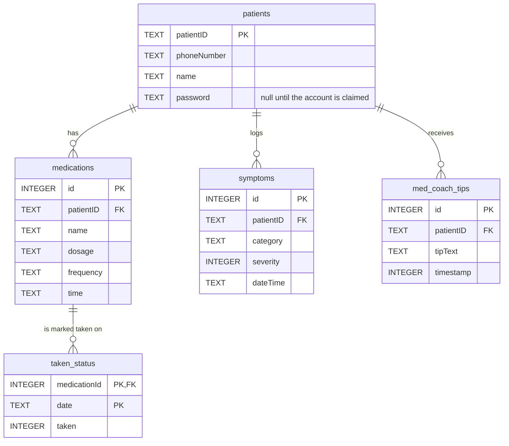

## Engineering highlights

- **A daily reset with no background work.** `taken_status` is keyed by
  `(medicationId, date)`, so a new day simply has no rows and every switch starts off —
  no alarm, WorkManager job or cleanup query. The home screen treats "today" as a
  `Flow<LocalDate>` that ticks over at midnight and uses `flatMapLatest` to swap in the
  new day's statuses. Toggles are recorded against the date on screen, so what the user
  taps is always what they see.
- **Lifecycle-aware state.** Screens collect with `collectAsStateWithLifecycle()`, so
  they stop receiving updates in the background. The home screen goes further: its
  state is shared with `SharingStarted.WhileSubscribed(5_000)`, so its database queries
  stop too, and when the app returns the next morning the date is re-read before the
  user touches anything.
- **Seeding that cannot race the UI.** Sample data is inserted in a
  `RoomDatabase.Callback.onCreate`, inside Room's database-creation transaction. No
  query can see the database before it is seeded, even a login fired the instant the
  app first opens.
- **Aggregation in SQL, not in memory.** The clinician dashboard gets every total from
  one SQL statement (counts, `AVG`, and `GROUP BY … ORDER BY COUNT(*)` for the top
  category). No rows are loaded into Kotlin, and all numbers come from one consistent
  snapshot.
- **A hand-drawn chart.** The trend chart is about 100 lines of `Canvas` drawing — axes,
  grid lines, labels via `TextMeasurer`, a path and data points. A charting library
  would have added a dependency and APK size for a single, simple chart, and custom
  drawing keeps full control over the Material 3 styling.
- **Manual dependency injection.** `MedTrackApplication` owns an `AppContainer` that
  creates the database and repositories once. ViewModel factories are built with
  `viewModelFactory { initializer { … } }`. ViewModels receive everything through their
  constructors (the session through the `SessionManager` interface), so tests can build
  them on in-memory fakes. For an app this size it gives the benefits of DI without
  annotation processing; Hilt is the natural next step if the dependency graph grows.
- **Errors are values; cancellation is not an error.** Network repositories return
  sealed results (`DrugSearchResult.Success / NotFound / Error`,
  `GenAiResult.Success / Error`) with user-facing messages. OpenFDA's "404 = no match"
  convention becomes `NotFound`. `CancellationException` is always rethrown, so leaving
  a screen mid-request cancels cleanly instead of showing a spurious error.
- **Privacy and secrets.** Patient tips use only that patient's data. Clinician
  insights receive aggregated statistics with no identifiers. The Gemini key lives in
  the git-ignored `local.properties`. HTTP logging is debug-only, and the key header is
  redacted even there.
- **A small release build.** R8 shrinking and resource shrinking take the demo APK
  down to about 2.4 MB, with keep rules only for the classes Gson reads by reflection.

## Getting started

### Try it without building

Download the APK from the [latest release](../../releases/latest) and install it on any
device or emulator running **Android 8.0 (API 26) or later**. The demo build ships
without a Gemini API key, so **Generate Tip** and **Find Patterns** show a "key missing"
message; everything else works.

### Build from source

Requirements:

- A recent version of Android Studio that supports Android Gradle Plugin 9.1.
  Gradle runs on JDK 21; the JDK bundled with Android Studio works.
- An emulator or device running Android 8.0 (API 26) or later.

Clone this repository, open the project folder in Android Studio, let Gradle sync and
run the `app` configuration. To build from the command line instead:

```bash
./gradlew assembleDebug
```

The release variant is minified with R8 and signed with the debug key, so anyone who
clones the repository can build an installable APK. Publishing to a store would need a
private keystore.

```bash
./gradlew assembleRelease
```

### Gemini API key (optional)

MedCoach's **Generate Tip** and the clinician **Find Patterns** button call Gemini.
Every other feature works without a key; those two show a friendly error instead.

1. Create a free key in [Google AI Studio](https://aistudio.google.com/apikey).
2. Add it to `local.properties` in the project root. The file is git-ignored.

   ```properties
   GEMINI_API_KEY=your_key_here
   ```

3. Sync Gradle and rebuild. The key reaches the app as `BuildConfig.GEMINI_API_KEY`.

> **Note:** anything compiled into an APK can be extracted from it. Don't publish an APK
> built with your personal key.

### Demo data

When the database is first created, the app seeds 10 sample patients with medications
and symptom history from [`app/src/main/assets/`](app/src/main/assets). Seeded patients
have no password yet, so choose one of two ways in:

- **Claim a sample account.** Tap *First-time login? Claim your account*, enter one
  of the IDs below, choose a password and log in:

  | Patient ID | Phone | Name |
  | --- | --- | --- |
  | `P1001` | `0412345678` | John Smith |
  | `P1002` | `0423456789` | Emily Davis |
  | `P1003` | `0434567890` | Michael Brown |

- **Sign up** as a new patient. The phone number must be 10 digits and start with `04`.

To open the **clinician dashboard**, go to Settings → Clinician Login and enter the
access key `dollar-entry-apples`.

## Testing

```bash
./gradlew testDebugUnitTest
```

19 JVM unit tests. ViewModels are tested with `kotlinx-coroutines-test`: a
`MainDispatcherRule` swaps in a test dispatcher, and in-memory fakes replace the Room
DAOs and the session.

- `HomeViewModelTest`: loads the checklist in schedule order, updates taken states
  when a switch is toggled, and starts an empty checklist when the date rolls over
  (driven by an injected date `Flow`).
- `LoginViewModelTest`: field validation, wrong-password handling, and starting a
  session on success.
- `DrugRepositoryTest`: runs against a fake `OpenFdaApi` and checks query building,
  mapping labels to `DrugInfo` (including missing-field fallbacks), 404 handling and
  error messages.
- `PasswordValidatorTest`: the password rules shared by Sign Up and Claim Account.

## Known limitations and next steps

MedTrack is a portfolio project, not production software. These are the gaps I would
close next:

- **Password storage.** Passwords are stored in plain text in the local database.
  A real app would hash them (for example with PBKDF2 or Argon2) or delegate
  authentication to a backend.
- **API key in the APK.** A build with a Gemini key embeds it in the APK. In
  production, AI requests should go through a backend so that no key ships with the app.
- **Hard-coded clinician key.** The clinician access key is a constant in the code
  rather than a real role-based login.
- **Test coverage.** There are no Room DAO tests (which would check the SQL, such as
  the dashboard aggregates) and no Compose UI tests yet.
- **Localisation.** UI text is written inline in Kotlin instead of string resources.

## Background

MedTrack began as a university coursework project in mobile application development.
I later cleaned it up for this portfolio.

## Disclaimer

MedTrack is a learning project and does not provide medical advice. Drug information
comes from the public openFDA dataset and is shown for reference only.

## Author

**Goey Qi Hang**
